# 🤖 AGENTIC AI: The Complete Guide to Autonomous Intelligence
<p align="center">
  
  
  
</p>

> **"The future belongs to autonomous agents that can think, plan, and act in our complex world."**

## 🌟 Quick Navigation
<table>
<tr>
<td>

**🎯 Foundations**
- [What is Agentic AI?](#1--what-is-agentic-ai)
- [Core Concepts](#2--core-concepts--principles)
- [Agent Types](#3--types-of-ai-agents)

</td>
<td>

**🏗️ Architecture**
- [System Design](#4--agent-architectures)
- [Frameworks](#5--popular-frameworks--platforms)
- [Technologies](#6--models--technologies)

</td>
<td>

**🚀 Applications**
- [Real-World Use Cases](#7--real-world-applications)
- [Building Agents](#8--building-your-first-agent)
- [Advanced Topics](#9--advanced-concepts)

</td>
</tr>
</table>

---

## 📋 TABLE OF CONTENTS

<details>
<summary><strong>Click to expand full table of contents</strong></summary>

1. [🎯 What is Agentic AI?](#1--what-is-agentic-ai)
2. [🧠 Core Concepts & Principles](#2--core-concepts--principles)
3. [🔄 Types of AI Agents](#3--types-of-ai-agents)
4. [🏗️ Agent Architectures](#4--agent-architectures)
5. [🛠️ Popular Frameworks & Platforms](#5--popular-frameworks--platforms)
6. [🧩 Models & Technologies](#6--models--technologies)
7. [🌍 Real-World Applications](#7--real-world-applications)
8. [🚀 Building Your First Agent](#8--building-your-first-agent)
9. [🎓 Advanced Concepts](#9--advanced-concepts)
10. [🔮 Future Trends](#10--future-trends)
11. [📚 Learning Resources](#11--learning-resources)
12. [🔗 Development Resources](#12--development-resources)

</details>

---

## 1. 🎯 WHAT IS AGENTIC AI?

<div align="center">

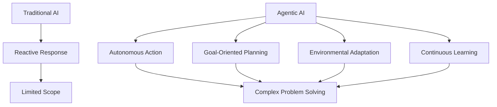

</div>

### 🔍 Definition
Agentic AI represents a revolutionary approach to artificial intelligence where systems don't just process and respond—they **think, plan, and act autonomously** to achieve specific goals. Unlike traditional AI that simply responds to inputs, agentic AI systems possess agency and can:

<table>
<tr>
<td>

**🧠 Cognitive Abilities**
- **Plan** multi-step actions
- **Reason** through complex scenarios
- **Learn** from experiences
- **Adapt** to new situations

</td>
<td>

**🎯 Operational Capabilities**
- **Execute** tasks independently
- **Interact** with external systems
- **Make decisions** autonomously
- **Coordinate** with other agents

</td>
</tr>
</table>

### 🌟 Key Characteristics

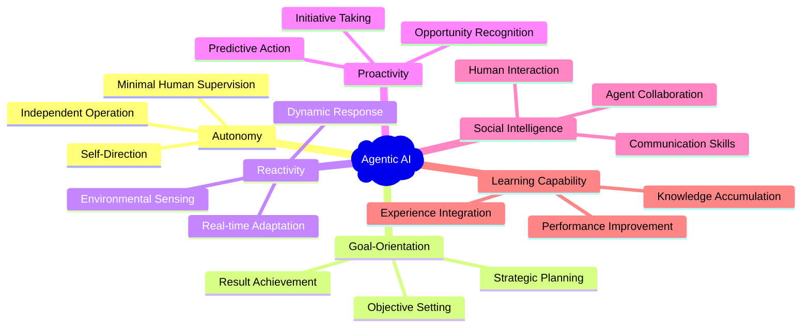

### 🚀 Why Agentic AI Matters

<div align="center">

| Traditional AI Limitations | Agentic AI Solutions |
|----------------------------|---------------------|
| ❌ Passive response only | ✅ Proactive problem-solving |
| ❌ Single-step processing | ✅ Multi-step planning |
| ❌ Human-dependent | ✅ Autonomous operation |
| ❌ Fixed behavior | ✅ Adaptive learning |
| ❌ Isolated systems | ✅ Collaborative networks |

</div>

### 🎯 Impact Areas

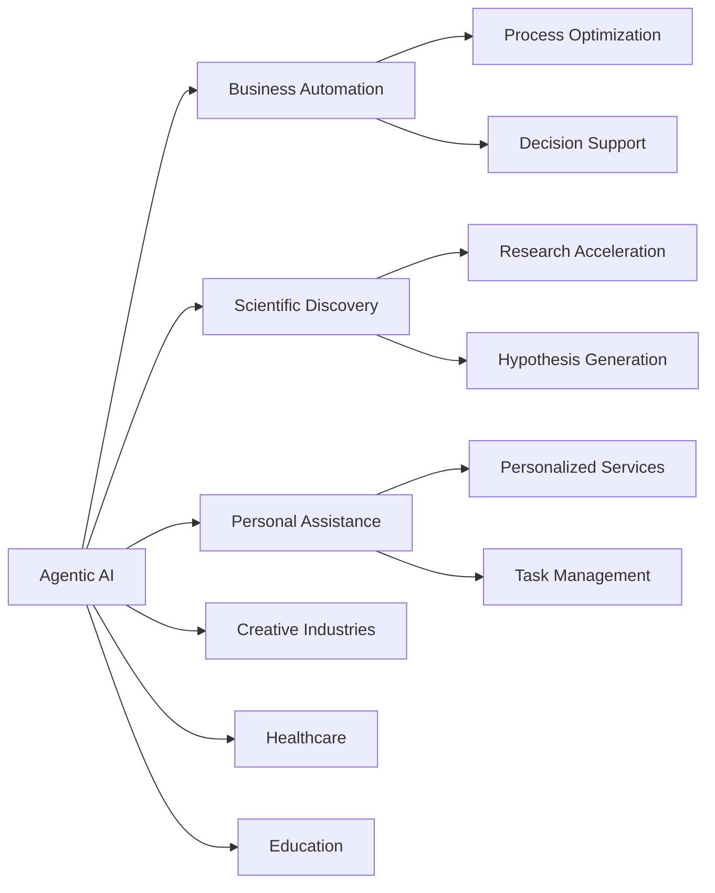

---

## 2. 🧠 CORE CONCEPTS & PRINCIPLES

### 2.1 Agent Architecture Overview

<div align="center">

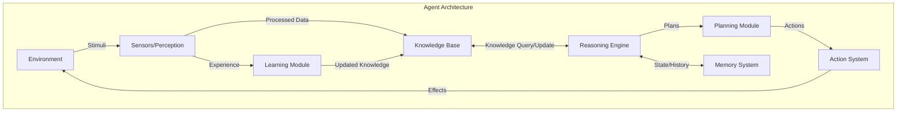

</div>

### 2.2 The Agent Loop (OODA Cycle)

<div align="center">

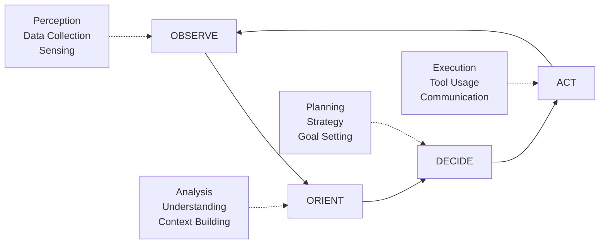

</div>

### 2.3 Agent Components Deep Dive

#### 🔍 Perception System
<table>
<tr>
<td width="50%">

**Sensory Input Processing**
- Natural language understanding
- Computer vision
- Audio processing
- Structured data analysis
- API responses

</td>
<td width="50%">

**State Recognition**
- Environment assessment
- Context awareness
- Pattern recognition
- Anomaly detection
- Trend analysis

</td>
</tr>
</table>

#### 🧠 Decision-Making Engine

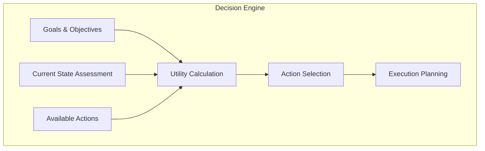

#### ⚡ Action System

| Component | Function | Examples |
|-----------|----------|----------|
| **Actuators** | Execute physical/digital actions | API calls, file operations, robot movement |
| **Tool Integration** | Interface with external systems | Databases, web services, software tools |
| **Communication** | Interact with humans/agents | Natural language, protocols, messaging |

### 2.4 Key Principles

#### 🎯 Rationality Framework

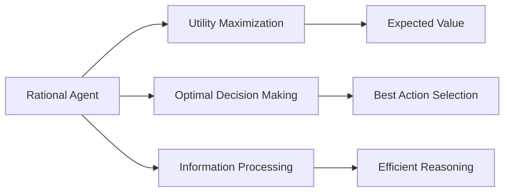

#### ⚖️ Bounded Rationality

| Constraint | Impact | Solution Strategy |
|------------|--------|-------------------|
| **Computational Limits** | Processing time bounds | Heuristics, approximations |
| **Information Incomplete** | Uncertainty in decisions | Probabilistic reasoning |
| **Time Pressure** | Quick decision needs | Satisficing vs optimizing |
| **Resource Constraints** | Limited memory/CPU | Efficient algorithms |

#### 🌊 Emergent Behavior

<div align="center">

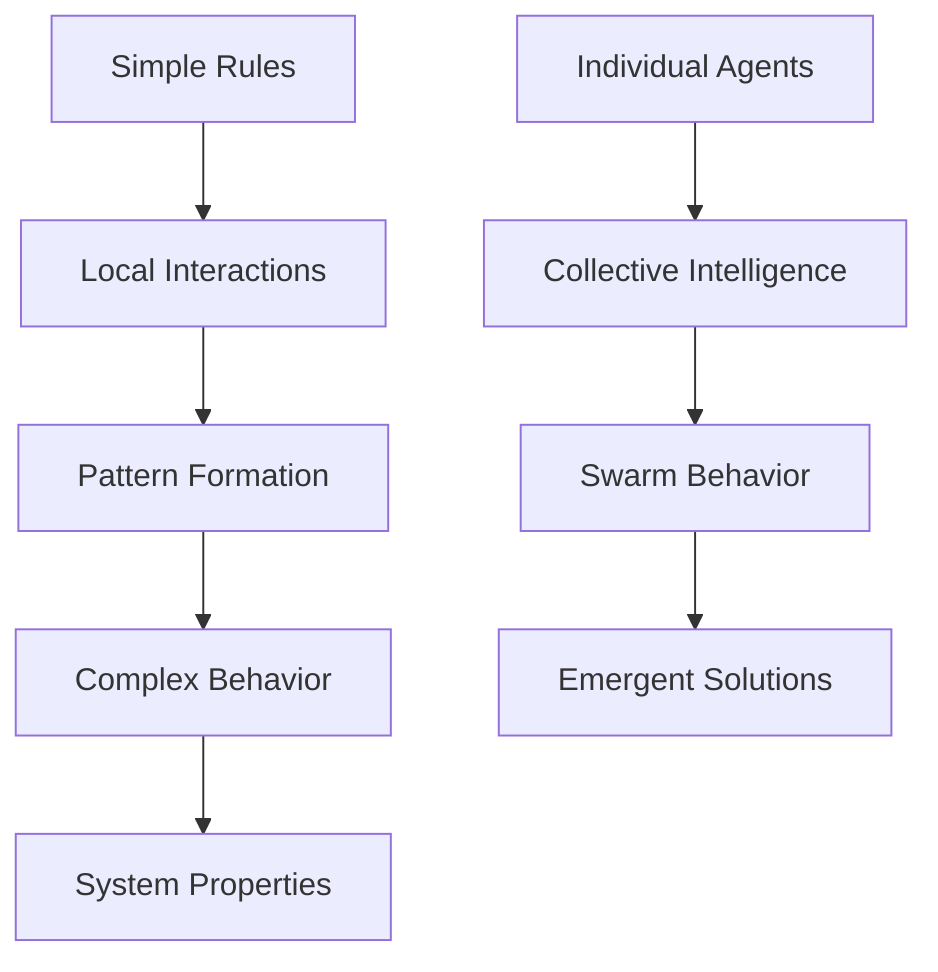

</div>

---

## 3. 🔄 TYPES OF AI AGENTS

### 3.1 Intelligence Hierarchy

<div align="center">

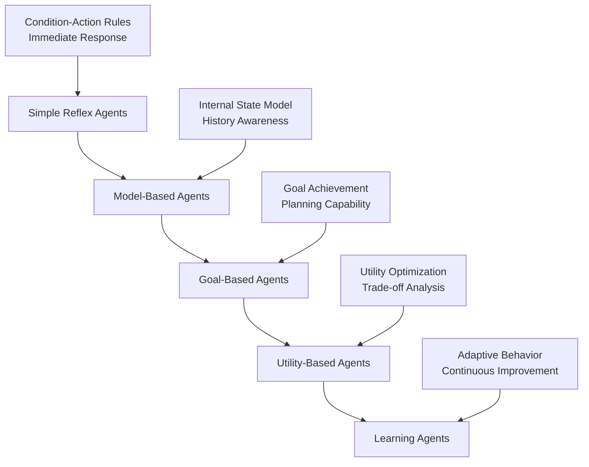

</div>

### 3.2 Agent Types Detailed Analysis

#### 1. 🔴 Simple Reflex Agents

<table>
<tr>
<td width="60%">

**Characteristics:**
- React to current percepts only
- No memory of past states
- Fast, predictable responses
- Rule-based decision making

**Example Implementation:**
```python
def thermostat_agent(temperature):
    if temperature > 75:
        return "turn_on_ac"
    elif temperature < 65:
        return "turn_on_heater"
    else:
        return "maintain"
```

</td>
<td width="40%">

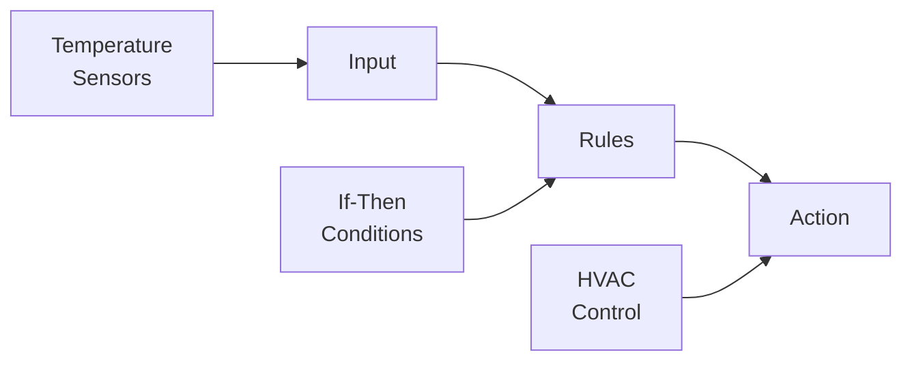

**Use Cases:**
- Thermostats
- Simple chatbots
- Alarm systems
- Basic automation

</td>
</tr>
</table>

#### 2. 🟡 Model-Based Reflex Agents

<div align="center">

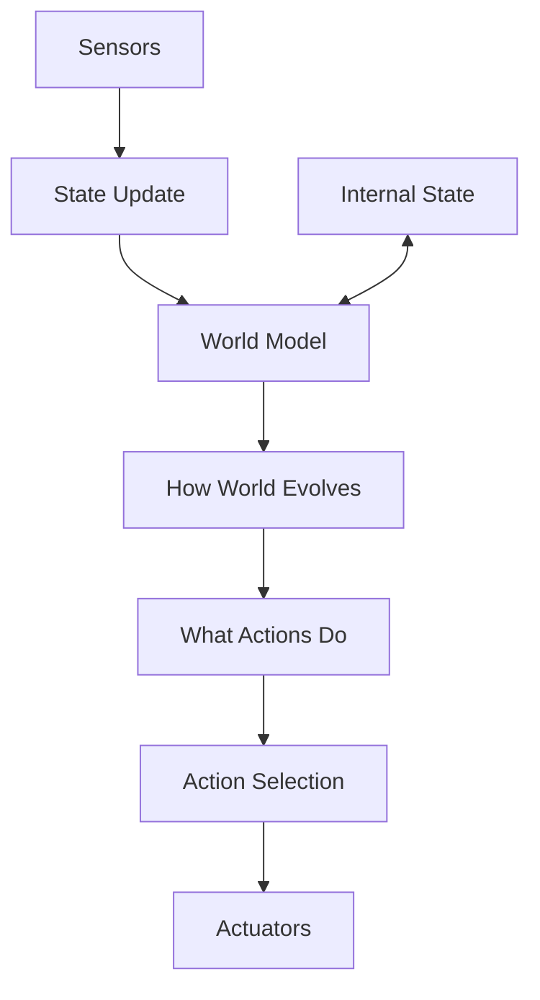

</div>

**Key Features:**
- Maintain internal representation of world
- Handle partial observability
- Use history for better decisions
- More robust than reflex agents

**Examples:** GPS navigation, game AI with memory

#### 3. 🟢 Goal-Based Agents

<table>
<tr>
<td>

**Planning Process:**
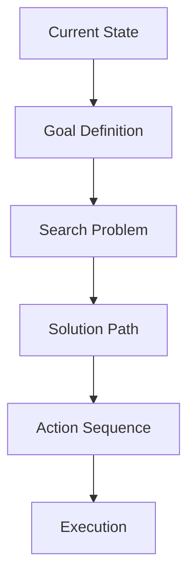

</td>
<td>

**Characteristics:**
- Work towards specific objectives
- Can plan multi-step sequences
- Flexible behavior patterns
- Search-based problem solving

**Applications:**
- Route planning
- Game playing (Chess, Go)
- Task scheduling
- Resource allocation

</td>
</tr>
</table>

#### 4. 🔵 Utility-Based Agents

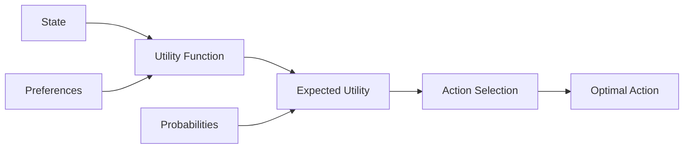

**Features:**
- Optimize utility/reward functions
- Handle conflicting goals
- Make trade-offs between options
- Quantitative decision making

#### 5. 🟣 Learning Agents

<div align="center">

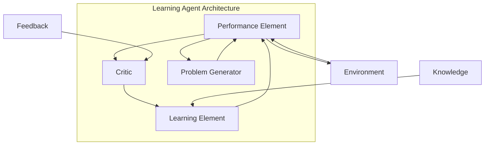

</div>

### 3.3 Functional Classification

#### 🎯 Task-Specific Agents

| Domain | Agent Type | Capabilities | Examples |
|--------|------------|--------------|----------|
| **Email** | Communication Assistant | Filtering, scheduling, responses | Gmail Smart Reply, Calendly |
| **Code** | Development Assistant | Generation, debugging, review | GitHub Copilot, Amazon CodeWhisperer |
| **Finance** | Trading Agent | Market analysis, risk assessment | Algorithmic trading bots |
| **Content** | Creative Assistant | Writing, design, editing | Jasper, Canva AI |

#### 🌐 General-Purpose Agents

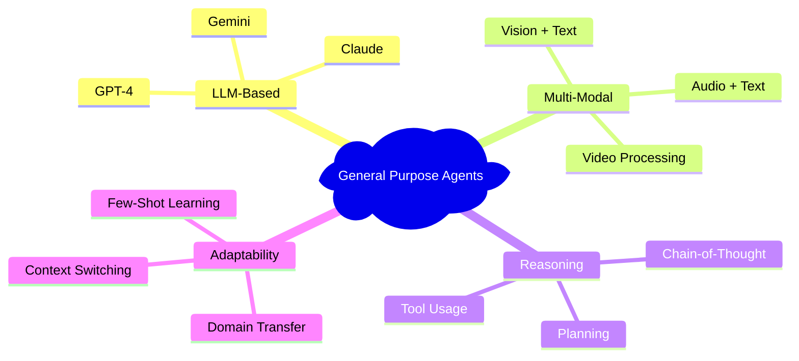

#### 🤝 Collaborative Agents

<div align="center">

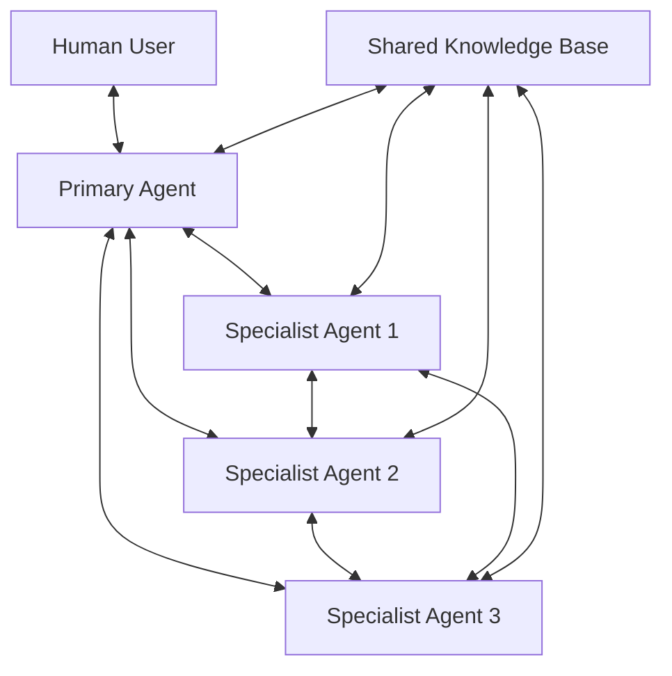

</div>

### 3.4 Environment-Based Classification

#### 💻 Software Agents
- **Environment**: Digital ecosystems
- **Capabilities**: Data processing, API integration, web interaction
- **Examples**: Web scrapers, monitoring systems, automation scripts

#### 🤖 Robotic Agents
- **Environment**: Physical world
- **Capabilities**: Manipulation, navigation, sensing
- **Examples**: Autonomous vehicles, manufacturing robots, drones

#### 🌐 Hybrid Agents
- **Environment**: Cyber-physical systems
- **Capabilities**: Bridge digital and physical worlds
- **Examples**: Smart home systems, IoT controllers, digital twins

---

## 4. 🏗️ AGENT ARCHITECTURES

### 4.1 Architecture Overview

<div align="center">

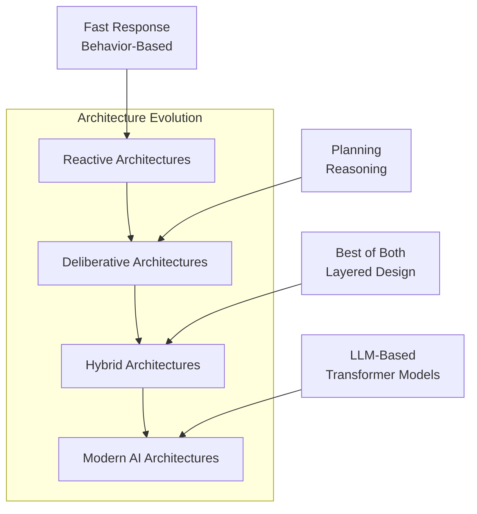

</div>

### 4.2 Reactive Architectures

#### 🔄 Subsumption Architecture

<div align="center">

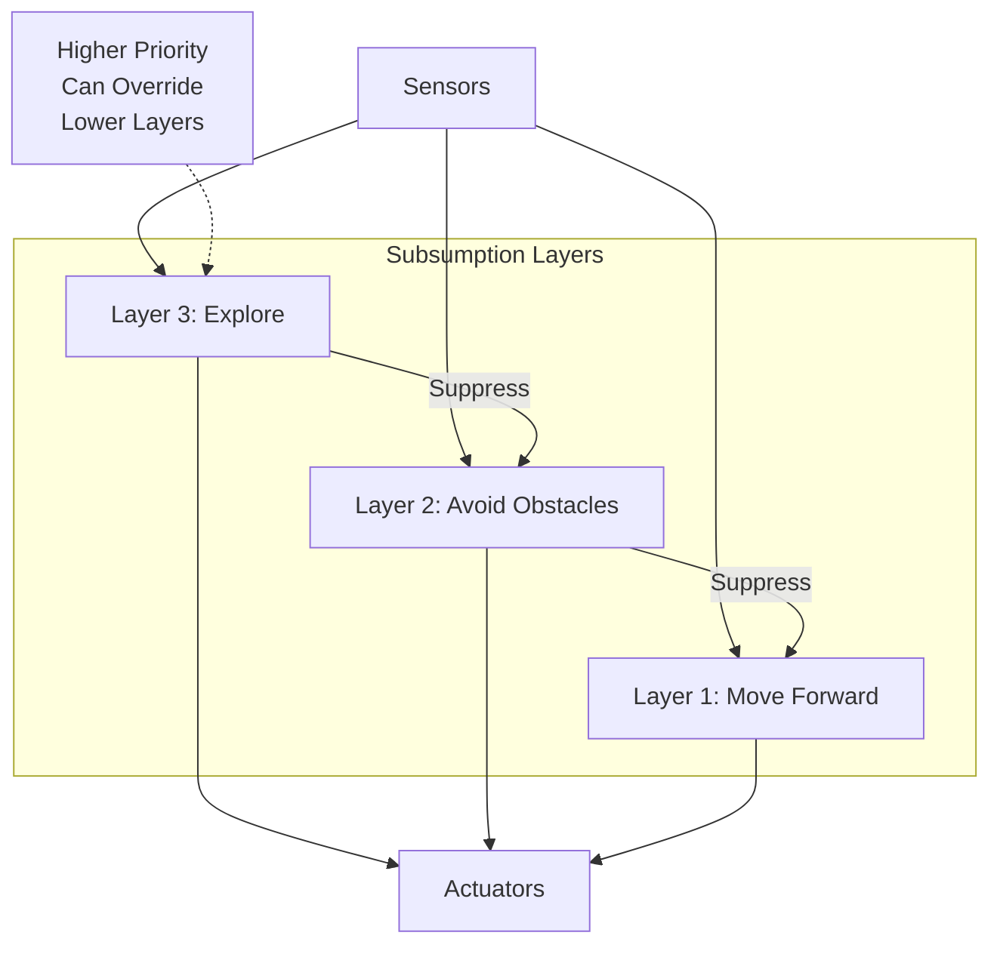

</div>

**Key Principles:**
- **Layered Behavior**: Each layer implements a specific behavior
- **Suppression**: Higher layers can override lower ones
- **No Central Control**: Distributed decision making
- **Real-time Response**: Fast reaction to environmental changes

#### 🌳 Behavior Trees

<table>
<tr>
<td width="50%">

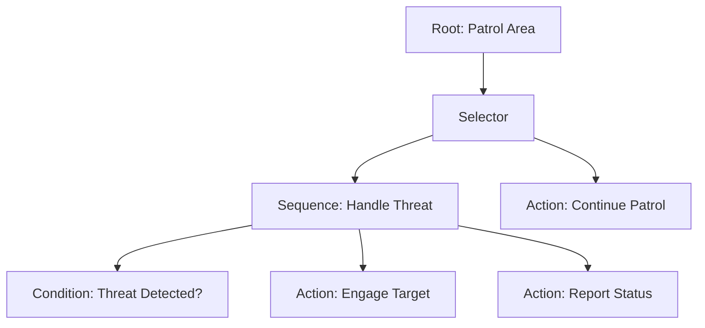

</td>
<td width="50%">

**Node Types:**
- **Composite Nodes**: Control flow (Sequence, Selector, Parallel)
- **Decorator Nodes**: Modify behavior (Repeat, Inverter, Timer)
- **Leaf Nodes**: Actions and conditions

**Advantages:**
- Modular and reusable
- Easy to debug and visualize
- Hierarchical decomposition
- Dynamic behavior switching

</td>
</tr>
</table>

### 4.3 Deliberative Architectures

#### 🎯 Classical Planning

<div align="center">

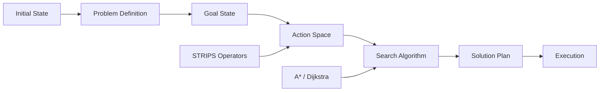

</div>

**Planning Components:**
- **State Space**: All possible world states
- **Actions**: Operations that change state
- **Goals**: Desired final states
- **Constraints**: Limitations and requirements

#### 🧠 Belief-Desire-Intention (BDI)

<table>
<tr>
<td>

```mermaid
graph TB
    A[Beliefs] --> D[Practical Reasoning]
    B[Desires] --> D
    C[Intentions] --> D
    
    D --> E[Plan Selection]
    E --> F[Plan Execution]
    F --> G[World Interaction]
    G --> A
```

</td>
<td>

**Components:**
- **Beliefs**: Agent's view of world state
- **Desires**: Goals the agent wants to achieve
- **Intentions**: Plans currently being executed

**Advantages:**
- Human-like reasoning process
- Explainable decision making
- Goal-oriented behavior
- Handles dynamic environments

</td>
</tr>
</table>

### 4.4 Hybrid Architectures

#### 🏛️ Three-Layer Architecture

<div align="center">

```mermaid
graph TB
    subgraph "Hybrid Architecture"
        A[Deliberative Layer]
        B[Executive Layer]
        C[Reactive Layer]
    end
    
    D[Environment] --> C
    C --> D
    
    C <--> B
    B <--> A
    
    A1[Long-term Planning<br/>Global Goals<br/>Strategy] --> A
    B1[Coordination<br/>Resource Management<br/>Plan Execution] --> B
    C1[Real-time Response<br/>Safety Behaviors<br/>Emergency Actions] --> C
```

</div>

**Layer Functions:**

| Layer | Time Scale | Function | Examples |
|-------|------------|----------|----------|
| **Deliberative** | Minutes-Hours | Long-term planning, strategy | Mission planning, resource allocation |
| **Executive** | Seconds-Minutes | Coordination, adaptation | Task switching, replanning |
| **Reactive** | Milliseconds-Seconds | Emergency response, safety | Obstacle avoidance, collision detection |

### 4.5 Modern AI Agent Architectures

#### 🤖 Transformer-Based Agents

<div align="center">

```mermaid
graph TB
    subgraph "LLM Agent Architecture"
        A[Input Processing]
        B[Context Window]
        C[Transformer Layers]
        D[Tool Selection]
        E[Action Generation]
        F[Output Processing]
    end
    
    G[User Query] --> A
    A --> B
    B --> C
    C --> D
    D --> E
    E --> F
    F --> H[Response/Action]
    
    I[Tool APIs] <--> D
    J[Memory System] <--> B
    K[Knowledge Base] <--> C
```

</div>

**Key Features:**
- **Context Management**: Handle long conversations and complex tasks
- **Tool Integration**: Access external APIs and services
- **Reasoning Capabilities**: Chain-of-thought and multi-step reasoning
- **Adaptive Behavior**: Learn from interactions and feedback

#### 🔍 Retrieval-Augmented Agents

<table>
<tr>
<td>

```mermaid
graph LR
    A[Query] --> B[Embedding]
    B --> C[Vector Search]
    C --> D[Knowledge Retrieval]
    D --> E[LLM Processing]
    E --> F[Response Generation]
    
    G[Vector Database] --> C
    H[Document Store] --> D
```

</td>
<td>

**Components:**
- **Vector Database**: Semantic search capability
- **Document Store**: Source of truth information
- **Embedding Models**: Convert text to vectors
- **Retrieval System**: Find relevant information

**Benefits:**
- Up-to-date information access
- Factual accuracy improvement
- Domain-specific knowledge
- Reduced hallucinations

</td>
</tr>
</table>

#### 🎭 Multi-Modal Agents

<div align="center">

```mermaid
graph TB
    subgraph "Multi-Modal Processing"
        A[Text Input] --> E[Unified Representation]
        B[Image Input] --> E
        C[Audio Input] --> E
        D[Video Input] --> E
    end
    
    E --> F[Cross-Modal Attention]
    F --> G[Reasoning Engine]
    G --> H[Action Planning]
    H --> I[Multi-Modal Output]
    
    I --> J[Text Response]
    I --> K[Image Generation]
    I --> L[Audio Synthesis]
```

</div>

**Capabilities:**
- **Vision-Language**: Understand and describe images
- **Audio Processing**: Speech recognition and synthesis
- **Video Analysis**: Temporal understanding and generation
- **Cross-Modal Reasoning**: Connect information across modalities

---

## 5. 🛠️ POPULAR FRAMEWORKS & PLATFORMS

### 5.1 Framework Ecosystem Overview

<div align="center">

```mermaid
graph TB
    subgraph "Agent Development Stack"
        A[Foundation Models] --> B[Agent Frameworks]
        B --> C[Development Tools]
        C --> D[Deployment Platforms]
    end
    
    A1[GPT-4, Claude, Gemini] --> A
    B1[LangChain, CrewAI, AutoGen] --> B
    C1[IDEs, Testing, Monitoring] --> C
    D1[Cloud, Edge, Hybrid] --> D
    
    E[Vector Stores] --> B
    F[APIs & Tools] --> B
    G[Memory Systems] --> B
```

</div>

### 5.2 Core Agent Frameworks

#### 🦜 LangChain - The Swiss Army Knife

<table>
<tr>
<td width="60%">

**Core Philosophy**: Build LLM applications with composable components

**Key Features**:
- **Chains**: Sequential component composition
- **Agents**: Reasoning and tool usage
- **Memory**: Conversation and context management
- **Tools**: External API integration
- **Callbacks**: Monitoring and logging

**Architecture**:
```mermaid
graph LR
    A[Input] --> B[Memory]
    B --> C[LLM]
    C --> D[Agent]
    D --> E[Tools]
    E --> F[Output]
    
    G[Vector Store] <--> B
    H[External APIs] <--> E
```

</td>
<td width="40%">

**Quick Start Example**:
```python
from langchain.agents import initialize_agent
from langchain.tools import BaseTool
from langchain.memory import ConversationBufferMemory

class CalculatorTool(BaseTool):
    name = "calculator"
    description = "Useful for math calculations"
    
    def _run(self, query: str) -> str:
        try:
            return str(eval(query))
        except:
            return "Invalid calculation"

# Initialize with memory
memory = ConversationBufferMemory(
    memory_key="chat_history"
)

agent = initialize_agent(
    tools=[CalculatorTool()],
    llm=llm,
    agent_type="conversational-react-description",
    memory=memory,
    verbose=True
)

# Use the agent
response = agent.run("What's 25 * 4?")
```

**Best For**: 
- Rapid prototyping
- Complex reasoning chains
- Tool integration
- Production applications

</td>
</tr>
</table>

#### 🦙 LlamaIndex - Data-Centric AI

<div align="center">

```mermaid
graph TB
    subgraph "LlamaIndex Architecture"
        A[Data Sources] --> B[Document Loading]
        B --> C[Chunking & Processing]
        C --> D[Embedding Generation]
        D --> E[Vector Index]
        E --> F[Query Engine]
        F --> G[Response Synthesis]
    end
    
    H[Files, APIs, DBs] --> A
    I[RAG Pipeline] --> F
    J[LLM Integration] --> G
```

</div>

**Strengths**:
- **Document Processing**: Advanced chunking and parsing
- **Index Management**: Multiple index types (vector, graph, keyword)
- **Query Optimization**: Sophisticated retrieval strategies
- **Multi-modal**: Support for text, images, tables

**Example Implementation**:
```python
from llama_index import VectorStoreIndex, SimpleDirectoryReader
from llama_index.memory import ChatMemoryBuffer

# Load documents
documents = SimpleDirectoryReader('data/').load_data()

# Create index
index = VectorStoreIndex.from_documents(documents)

# Create chat engine with memory
memory = ChatMemoryBuffer.from_defaults(token_limit=3000)
chat_engine = index.as_chat_engine(
    chat_mode="condense_question",
    memory=memory,
    verbose=True
)

# Query with context
response = chat_engine.chat("Summarize the main findings")
```

#### 👥 CrewAI - Multi-Agent Orchestration

<table>
<tr>
<td>

**Philosophy**: Simulate human team dynamics with AI agents

```mermaid
graph TB
    A[Project Manager Agent] --> B[Research Agent]
    A --> C[Writer Agent]
    A --> D[Reviewer Agent]
    
    B --> E[Data Collection]
    C --> F[Content Creation]
    D --> G[Quality Assurance]
    
    H[Shared Knowledge] <--> A
    H <--> B
    H <--> C
    H <--> D
```

</td>
<td>

**Key Features**:
- **Role-Based Agents**: Specialized team members
- **Hierarchical Tasks**: Complex workflow management
- **Collaborative Decision Making**: Agents work together
- **Process Control**: Sequential, parallel, consensus flows

**Example Use Case**:
```python
from crewai import Agent, Task, Crew, Process

# Define specialized agents
researcher = Agent(
    role='Market Researcher',
    goal='Gather comprehensive market data',
    backstory='10+ years in market analysis',
    tools=[web_search_tool, data_analysis_tool]
)

analyst = Agent(
    role='Data Analyst',
    goal='Analyze trends and patterns',
    backstory='Expert in statistical analysis'
)

writer = Agent(
    role='Report Writer',
    goal='Create compelling reports',
    backstory='Technical writing specialist'
)

# Define tasks
research_task = Task(
    description='Research AI market trends for 2025',
    agent=researcher,
    expected_output='Comprehensive market data'
)

analysis_task = Task(
    description='Analyze the research data',
    agent=analyst,
    expected_output='Statistical insights'
)

writing_task = Task(
    description='Write executive summary',
    agent=writer,
    expected_output='Professional report'
)

# Create and execute crew
crew = Crew(
    agents=[researcher, analyst, writer],
    tasks=[research_task, analysis_task, writing_task],
    process=Process.sequential
)

result = crew.kickoff()
```

</td>
</tr>
</table>

#### 🤖 AutoGen - Conversational Multi-Agent Systems

<div align="center">

```mermaid
graph LR
    A[Human User] <--> B[UserProxy Agent]
    B <--> C[Assistant Agent]
    C <--> D[Code Executor Agent]
    C <--> E[Reviewer Agent]
    
    F[Group Chat] --> G[Automatic Speaker Selection]
    G --> H[Dynamic Conversation Flow]
```

</div>

**Microsoft's Approach**:
- **Conversational Framework**: Agents communicate naturally
- **Code Execution**: Built-in code running capabilities
- **Human-in-the-Loop**: Seamless human oversight
- **Flexible Workflows**: Adaptable conversation patterns

#### 🔍 Haystack - Production NLP Pipelines

**Enterprise-Grade Features**:
- **Pipeline Architecture**: Modular, scalable design
- **Production Ready**: Monitoring, caching, optimization
- **Multi-modal**: Text, tables, images
- **Enterprise Security**: Authentication, authorization

```python
from haystack import Pipeline
from haystack.nodes import PreProcessor, EmbeddingRetriever, FARMReader

# Create pipeline
pipeline = Pipeline()
pipeline.add_node(component=preprocessor, name="Preprocessor", inputs=["File"])
pipeline.add_node(component=retriever, name="Retriever", inputs=["Preprocessor"])
pipeline.add_node(component=reader, name="Reader", inputs=["Retriever"])

# Run pipeline
result = pipeline.run(query="What are the benefits of AI agents?")
```

### 5.3 Specialized Frameworks

#### 🎯 Domain-Specific Solutions

| Framework | Domain | Strengths | Use Cases |
|-----------|--------|-----------|-----------|
| **Rasa** | Conversational AI | NLU, Dialogue Management | Chatbots, Voice Assistants |
| **Botpress** | Bot Development | Visual Builder, Integrations | Customer Service, Automation |
| **Langroid** | Multi-Agent Tasks | Task-oriented, Structured | Business Process Automation |
| **AutoGPT** | Autonomous Tasks | Goal-oriented, Self-directing | Personal Assistants, Research |

#### 🔄 Workflow Orchestration

<div align="center">

```mermaid
graph TB
    subgraph "Workflow Patterns"
        A[Sequential] --> B[Parallel]
        B --> C[Conditional]
        C --> D[Loop]
        D --> E[Error Handling]
    end
    
    F[Task Definition] --> A
    G[Agent Assignment] --> A
    H[Resource Management] --> A
    I[Progress Monitoring] --> A
```

</div>

### 5.4 Cloud Platforms & Enterprise Solutions

<div align="center">

```mermaid
graph TB
    subgraph "Cloud AI Platforms"
        A[Google Cloud] --> A1[Vertex AI]
        A --> A2[Gemini API]
        A --> A3[AI Studio]
        
        B[Microsoft Azure] --> B1[OpenAI Service]
        B --> B2[Cognitive Services]
        B --> B3[Bot Framework]
        
        C[Amazon AWS] --> C1[Bedrock]
        C --> C2[SageMaker]
        C --> C3[Lex/Connect]
        
        D[Specialized] --> D1[OpenAI Platform]
        D --> D2[Anthropic Claude]
        D --> D3[Hugging Face Hub]
    end
```

</div>

#### 🌐 Google Cloud AI

<table>
<tr>
<td width="50%">

**Vertex AI Platform**
- **Gemini Models**: Multi-modal capabilities
- **Custom Training**: Fine-tuning on your data
- **MLOps**: Complete ML lifecycle management
- **Enterprise Security**: VPC, IAM, compliance

**AI Studio**
- **Rapid Prototyping**: No-code agent building
- **Prompt Engineering**: Advanced testing tools
- **Model Comparison**: Side-by-side evaluation
- **Integration**: Direct deployment to production

</td>
<td width="50%">

**Implementation Example**:
```python
import vertexai
from vertexai.generative_models import GenerativeModel

# Initialize Vertex AI
vertexai.init(project="your-project", location="us-central1")

# Create model instance
model = GenerativeModel("gemini-pro")

# Generate with function calling
response = model.generate_content(
    contents=["Analyze this data and create a report"],
    tools=[data_analysis_tool],
    stream=False
)

print(response.text)
```

**Pricing**: Pay-per-request with enterprise discounts

</td>
</tr>
</table>

#### 🔷 Microsoft Azure AI

<div align="center">

```mermaid
graph LR
    A[Azure OpenAI] --> B[GPT-4 Models]
    A --> C[DALL-E]
    A --> D[Whisper]
    
    E[Cognitive Services] --> F[Speech]
    E --> G[Vision]
    E --> H[Language]
    
    I[Bot Framework] --> J[Teams Integration]
    I --> K[Web Chat]
    I --> L[Voice Assistants]
```

</div>

**Enterprise Features**:
- **Private Endpoints**: Secure model access
- **Content Filtering**: Built-in safety measures
- **Compliance**: SOC, HIPAA, FedRAMP certified
- **Global Scale**: Multiple regions available

#### ⚡ Amazon AWS Bedrock

**Foundation Model Choice**:
- **Claude (Anthropic)**: Long context, safety-focused
- **Titan (Amazon)**: Optimized for AWS services
- **Llama 2 (Meta)**: Open-source alternative
- **Cohere**: Enterprise NLP capabilities

**Agent Runtime**:
```python
import boto3

bedrock = boto3.client('bedrock-runtime')

response = bedrock.invoke_model(
    modelId='anthropic.claude-v2',
    body=json.dumps({
        'prompt': 'Create an action plan for reducing energy consumption',
        'max_tokens_to_sample': 1000
    })
)

result = json.loads(response['body'].read())
```

#### 🤖 Specialized AI Platforms

| Platform | Strengths | Best For | Pricing |
|----------|-----------|----------|---------|
| **OpenAI Platform** | Latest models, function calling | Rapid development, experimentation | Pay-per-token |
| **Anthropic Claude** | Safety, long context (200K tokens) | Enterprise applications, content analysis | Pay-per-token |
| **Hugging Face** | Open source, model variety | Research, custom models | Free tier + inference |
| **Replicate** | Easy model deployment | Model hosting, API access | Pay-per-second |

### 5.5 Development & Deployment Tools

#### 🔨 Development Environment

<table>
<tr>
<td>

**IDEs & Extensions**
- **VS Code**: GitHub Copilot, Python extensions
- **PyCharm**: Professional Python development
- **Jupyter**: Interactive development and experimentation
- **Google Colab**: Free GPU/TPU access

**Debugging & Monitoring**
- **LangSmith**: LangChain application monitoring
- **Weights & Biases**: Experiment tracking
- **Streamlit**: Rapid UI development
- **Gradio**: Quick model interfaces

</td>
<td>

**Testing Frameworks**
```python
# Agent testing example
import pytest
from langchain.agents import initialize_agent

@pytest.fixture
def test_agent():
    return initialize_agent(
        tools=[calculator_tool],
        llm=test_llm,
        agent_type="zero-shot-react-description"
    )

def test_agent_calculation(test_agent):
    response = test_agent.run("What is 25 * 4?")
    assert "100" in response

def test_agent_error_handling(test_agent):
    response = test_agent.run("Invalid request")
    assert response is not None
```

</td>
</tr>
</table>

#### 🚀 Deployment Options

<div align="center">

```mermaid
graph TB
    subgraph "Deployment Strategies"
        A[Local Development] --> B[Cloud Deployment]
        B --> C[Edge Deployment]
        C --> D[Hybrid Systems]
    end
    
    A1[Docker Containers] --> A
    B1[Kubernetes] --> B
    B2[Serverless Functions] --> B
    C1[Mobile Devices] --> C
    C2[IoT Devices] --> C
    D1[Multi-Cloud] --> D
    D2[On-Premise + Cloud] --> D
```

</div>

**Container Orchestration**:
```yaml
# docker-compose.yml for agent deployment
version: '3.8'
services:
  agent-api:
    build: .
    ports:
      - "8000:8000"
    environment:
      - OPENAI_API_KEY=${OPENAI_API_KEY}
      - VECTOR_DB_URL=${VECTOR_DB_URL}
    volumes:
      - ./data:/app/data
    
  redis:
    image: redis:alpine
    ports:
      - "6379:6379"
    
  vector-db:
    image: qdrant/qdrant
    ports:
      - "6333:6333"
```

### 5.6 Framework Comparison Matrix

| Framework | Learning Curve | Production Ready | Multi-Agent | Community | Best For |
|-----------|---------------|------------------|-------------|-----------|----------|
| **LangChain** | Medium | ⭐⭐⭐⭐ | ⭐⭐⭐ | ⭐⭐⭐⭐⭐ | General purpose, rapid development |
| **LlamaIndex** | Medium | ⭐⭐⭐⭐⭐ | ⭐⭐ | ⭐⭐⭐⭐ | RAG applications, data-heavy use cases |
| **CrewAI** | Easy | ⭐⭐⭐ | ⭐⭐⭐⭐⭐ | ⭐⭐⭐ | Team-based workflows, role-playing |
| **AutoGen** | Medium | ⭐⭐⭐ | ⭐⭐⭐⭐⭐ | ⭐⭐⭐⭐ | Conversational agents, code generation |
| **Haystack** | Hard | ⭐⭐⭐⭐⭐ | ⭐⭐ | ⭐⭐⭐ | Enterprise NLP, production pipelines |
| **Rasa** | Hard | ⭐⭐⭐⭐⭐ | ⭐⭐ | ⭐⭐⭐⭐ | Conversational AI, chatbots |

### 5.7 Getting Started Recommendations

#### 🎯 By Experience Level

**Beginners (0-6 months)**:
1. Start with **LangChain** + **OpenAI API**
2. Build simple chatbot with **Streamlit**
3. Experiment with **Google Colab**
4. Join **LangChain Discord** community

**Intermediate (6+ months)**:
1. Explore **CrewAI** for multi-agent systems
2. Implement **RAG** with **LlamaIndex**
3. Deploy with **Docker** + **FastAPI**
4. Monitor with **LangSmith**

**Advanced (1+ years)**:
1. Custom **agent architectures**
2. **Enterprise deployment** with **Kubernetes**
3. **Model fine-tuning** and optimization
4. **Open source contributions**

#### 🏢 By Use Case

**Business Automation**: LangChain + Azure OpenAI + Power Platform
**Customer Service**: Rasa + Botpress + CRM integration
**Data Analysis**: LlamaIndex + Jupyter + Visualization tools
**Content Creation**: CrewAI + Multiple LLMs + Review workflows
**Research & Development**: AutoGen + Multiple models + Code execution

---

#### Botpress
- **Purpose**: Visual bot building platform
- **Features**: Flow designer, NLU, integrations
- **Advantages**: No-code/low-code approach

===============================================

## 6. 🧩 MODELS & TECHNOLOGIES

### 6.1 Foundation Model Landscape

<div align="center">

```mermaid
graph TB
    subgraph "Foundation Models Ecosystem"
        A[Language Models] --> A1[GPT-4/4o]
        A --> A2[Claude 3.5]
        A --> A3[Gemini Ultra]
        A --> A4[LLaMA 3]
        
        B[Multimodal Models] --> B1[GPT-4V]
        B --> B2[Gemini Vision]
        B --> B3[Claude Vision]
        
        C[Specialized Models] --> C1[Code: GitHub Copilot]
        C --> C2[Image: DALL-E 3]
        C --> C3[Audio: Whisper]
        C --> C4[Video: Sora]
    end
    
    D[Model Selection] --> E[Task Requirements]
    D --> F[Performance Needs]
    D --> G[Cost Constraints]
    D --> H[Safety Requirements]
```

</div>

### 6.2 Large Language Models Deep Dive

#### 🤖 GPT Family (OpenAI)

<table>
<tr>
<td width="50%">

**Model Variants**:
- **GPT-4o**: Latest multimodal model
- **GPT-4 Turbo**: High performance, 128K context
- **GPT-3.5 Turbo**: Cost-effective, fast responses
- **GPT-4V**: Vision capabilities

**Core Capabilities**:
- Advanced reasoning and planning
- Function calling and tool usage
- Code generation and debugging
- Creative content creation
- Multi-step problem solving

</td>
<td width="50%">

**Technical Specifications**:
```mermaid
graph LR
    A[GPT-4] --> B[175B+ Parameters]
    A --> C[32K-128K Context]
    A --> D[Multimodal Input]
    A --> E[Function Calling]
    
    F[Performance] --> G[MMLU: 86.4%]
    F --> H[HumanEval: 67%]
    F --> I[HellaSwag: 95.3%]
```

**Best For**:
- Complex reasoning tasks
- Creative applications
- Business automation
- Research and analysis

</td>
</tr>
</table>

#### 🎭 Claude (Anthropic)

<div align="center">

```mermaid
graph TB
    subgraph "Claude 3 Family"
        A[Claude 3.5 Sonnet] --> A1[200K Context]
        A --> A2[Constitutional AI]
        A --> A3[Safety Focused]
        
        B[Claude 3 Opus] --> B1[Highest Capability]
        B --> B2[Complex Reasoning]
        
        C[Claude 3 Haiku] --> C1[Fastest Response]
        C --> C2[Cost Effective]
    end
    
    D[Constitutional Training] --> E[Human Feedback]
    D --> F[AI Feedback]
    D --> G[Principle Following]
```

</div>

**Unique Features**:
- **Constitutional AI**: Trained with explicit principles
- **Long Context**: Up to 200K tokens (1M+ in research)
- **Safety First**: Reduced harmful outputs
- **Honest Uncertainty**: Admits when unsure

#### 🌟 Gemini (Google)

**Model Tiers**:
- **Gemini Ultra**: Most capable, complex tasks
- **Gemini Pro**: Balanced performance and cost
- **Gemini Nano**: On-device applications

**Multimodal Integration**:
```python
import google.generativeai as genai

# Configure the model
model = genai.GenerativeModel('gemini-pro-vision')

# Multimodal input
response = model.generate_content([
    "Analyze this image and data:",
    image_input,
    "What trends do you observe?"
])
```

#### 🦙 Open Source Models

| Model | Developer | Parameters | Strengths | License |
|-------|-----------|------------|-----------|---------|
| **LLaMA 3** | Meta | 8B, 70B, 405B | Efficiency, customization | Custom |
| **Mixtral 8x7B** | Mistral AI | 56B (MoE) | Performance/cost ratio | Apache 2.0 |
| **CodeLlama** | Meta | 7B, 13B, 34B | Code generation | Custom |
| **Phi-3** | Microsoft | 3.8B, 7B, 14B | Small size, high performance | MIT |

### 6.3 Agent-Specific Technologies

#### 🛠️ Tool Use & Function Calling

<div align="center">

```mermaid
graph LR
    A[User Query] --> B[Intent Recognition]
    B --> C[Function Selection]
    C --> D[Parameter Extraction]
    D --> E[API Call]
    E --> F[Result Processing]
    F --> G[Response Generation]
    
    H[Available Tools] --> C
    I[Schema Validation] --> D
    J[Error Handling] --> E
```

</div>

**Implementation Patterns**:

<table>
<tr>
<td width="50%">

**OpenAI Function Calling**:
```python
functions = [{
    "name": "get_weather",
    "description": "Get current weather",
    "parameters": {
        "type": "object",
        "properties": {
            "location": {
                "type": "string",
                "description": "City name"
            }
        },
        "required": ["location"]
    }
}]

response = client.chat.completions.create(
    model="gpt-4",
    messages=messages,
    functions=functions,
    function_call="auto"
)
```

</td>
<td width="50%">

**Claude Tool Usage**:
```python
tools = [{
    "name": "calculator",
    "description": "Perform calculations",
    "input_schema": {
        "type": "object",
        "properties": {
            "expression": {
                "type": "string",
                "description": "Math expression"
            }
        }
    }
}]

message = client.messages.create(
    model="claude-3-sonnet-20240229",
    max_tokens=1000,
    tools=tools,
    messages=[{"role": "user", "content": "What's 123 * 456?"}]
)
```

</td>
</tr>
</table>

#### 🧠 Memory Systems Architecture

<div align="center">

```mermaid
graph TB
    subgraph "Memory Types"
        A[Short-term Memory] --> A1[Conversation Buffer]
        A --> A2[Working Memory]
        
        B[Long-term Memory] --> B1[Vector Storage]
        B --> B2[Graph Knowledge]
        B --> B3[Episodic Memory]
        
        C[Semantic Memory] --> C1[Facts & Concepts]
        C --> C2[Skills & Procedures]
    end
    
    D[Memory Management] --> E[Retrieval Strategies]
    D --> F[Forgetting Mechanisms]
    D --> G[Memory Consolidation]
```

</div>

**Vector Database Comparison**:

| Database | Type | Strengths | Best For |
|----------|------|-----------|----------|
| **Pinecone** | Managed | Scalability, performance | Production applications |
| **Weaviate** | Open source | Schema flexibility, hybrid search | Complex data relationships |
| **Chroma** | Lightweight | Simplicity, local development | Prototyping, small projects |
| **Qdrant** | High performance | Speed, advanced filtering | Real-time applications |
| **Milvus** | Distributed | Massive scale, GPU acceleration | Enterprise, big data |

#### 🔍 Retrieval Systems

<table>
<tr>
<td>

**Dense Retrieval (Semantic)**:
```python
from sentence_transformers import SentenceTransformer
import numpy as np

# Encode query and documents
model = SentenceTransformer('all-MiniLM-L6-v2')
query_embedding = model.encode(query)
doc_embeddings = model.encode(documents)

# Calculate similarities
similarities = np.dot(query_embedding, doc_embeddings.T)
top_docs = np.argsort(similarities)[-k:]
```

</td>
<td>

**Hybrid Retrieval**:
```mermaid
graph LR
    A[Query] --> B[Dense Retrieval]
    A --> C[Sparse Retrieval]
    
    B --> D[Semantic Results]
    C --> E[Keyword Results]
    
    D --> F[Result Fusion]
    E --> F
    
    F --> G[Ranked Results]
```

**Benefits**:
- Combines semantic and keyword matching
- Better recall and precision
- Handles diverse query types

</td>
</tr>
</table>

### 6.4 Training Methodologies

#### 🎯 Supervised Learning for Agents

<div align="center">

```mermaid
graph LR
    A[Training Data] --> B[Input Examples]
    A --> C[Expected Outputs]
    
    B --> D[Model Training]
    C --> D
    
    D --> E[Validation]
    E --> F[Performance Metrics]
    F --> G[Model Deployment]
```

</div>

**Applications**:
- Classification tasks (intent recognition)
- Sequence generation (responses)
- Function prediction (tool selection)

#### 🔄 Reinforcement Learning

**RL for Agent Training**:
```python
import gym
from stable_baselines3 import PPO

# Create environment
env = gym.make('CartPole-v1')

# Initialize agent
model = PPO('MlpPolicy', env, verbose=1)

# Train agent
model.learn(total_timesteps=10000)

# Use trained agent
obs = env.reset()
action, _states = model.predict(obs)
```

**Key Algorithms**:
- **PPO**: Proximal Policy Optimization
- **DQN**: Deep Q-Network
- **A3C**: Asynchronous Actor-Critic
- **SAC**: Soft Actor-Critic

#### 🎭 Imitation Learning

<table>
<tr>
<td>

**Behavioral Cloning**:
- Learn from expert demonstrations
- Supervised learning on state-action pairs
- Fast training, good for well-defined tasks

**Inverse Reinforcement Learning**:
- Infer reward function from expert behavior
- More generalizable than behavioral cloning
- Handles complex, multi-objective scenarios

</td>
<td>

```mermaid
graph TB
    A[Expert Demonstrations] --> B[State-Action Pairs]
    B --> C[Supervised Learning]
    C --> D[Policy Network]
    
    E[Expert Behavior] --> F[Reward Inference]
    F --> G[Reinforcement Learning]
    G --> H[Learned Policy]
```

</td>
</tr>
</table>

#### 🧠 Meta-Learning ("Learning to Learn")

**Few-Shot Learning**:
```python
# Example: Few-shot classification with meta-learning
class MetaLearner:
    def __init__(self, model):
        self.model = model
        
    def adapt(self, support_set, query_set):
        # Quick adaptation to new task
        adapted_model = self.model.clone()
        adapted_model.fit(support_set, epochs=5)
        return adapted_model.predict(query_set)
```

**Applications**:
- Rapid adaptation to new domains
- Few-shot task learning
- Personalization of agents

### 6.5 Emerging Technologies

#### 🔮 Next-Generation Capabilities

<div align="center">

```mermaid
mindmap
  root)Emerging Tech(
    Multimodal Fusion
      Vision-Language Models
      Audio-Visual Processing
      Cross-Modal Reasoning
    Long Context
      Million Token Models
      Hierarchical Attention
      Memory Architectures
    Reasoning
      Chain-of-Thought
      Tree of Thoughts
      Symbolic Integration
    Efficiency
      Model Compression
      Edge Deployment
      Federated Learning
```

</div>

**Research Frontiers**:
- **Mixture of Experts (MoE)**: Scaling with efficiency
- **Retrieval-Augmented Generation**: External knowledge integration
- **Constitutional AI**: Value-aligned training
- **Neurosymbolic AI**: Combining neural and symbolic reasoning

---

## 7. 🌍 REAL-WORLD APPLICATIONS

### 7.1 Application Landscape Overview

<div align="center">

```mermaid
mindmap
  root)Agentic AI Applications(
    Business
      Customer Service
      Sales Automation
      Process Optimization
      Decision Support
    Technology
      Software Development
      DevOps Automation
      System Monitoring
      Code Review
    Creative
      Content Creation
      Design Assistance
      Marketing Campaigns
      Media Production
    Scientific
      Research Acceleration
      Data Analysis
      Hypothesis Generation
      Literature Review
    Personal
      Virtual Assistants
      Education Support
      Health Monitoring
      Financial Planning
```

</div>

### 7.2 Customer Service & Support Revolution

#### 🎧 Intelligent Customer Service Agents

<table>
<tr>
<td width="50%">

**Core Capabilities**:
- **Natural Language Understanding**: Comprehend complex queries in multiple languages
- **Context Retention**: Remember conversation history and customer preferences
- **Emotional Intelligence**: Detect sentiment and respond appropriately
- **Omnichannel Support**: Consistent experience across chat, email, voice
- **Escalation Management**: Know when to transfer to human agents

**Implementation Architecture**:
```mermaid
graph LR
    A[Customer Input] --> B[NLU Processing]
    B --> C[Intent Classification]
    C --> D[Context Retrieval]
    D --> E[Response Generation]
    E --> F[Sentiment Analysis]
    F --> G[Action Selection]
    
    H[Knowledge Base] <--> D
    I[CRM System] <--> D
    J[Escalation Rules] --> G
```

</td>
<td width="50%">

**Real-World Examples**:

| Company | Implementation | Results |
|---------|---------------|---------|
| **Klarna** | AI shopping assistant | 2/3 of customer chats handled by AI |
| **Intercom** | Resolution Bot | 31% faster resolution times |
| **Zendesk** | Answer Bot | 23% reduction in ticket volume |

**Success Metrics**:
- **First Contact Resolution**: 60-80% improvement
- **Response Time**: Sub-second responses
- **Customer Satisfaction**: 85%+ CSAT scores
- **Cost Reduction**: 30-50% lower support costs

**Implementation Example**:
```python
from langchain.agents import initialize_agent
from langchain.tools import Tool
from langchain.memory import ConversationBufferWindowMemory

# Customer service agent setup
def create_support_agent():
    tools = [
        Tool(name="knowledge_search", func=search_kb),
        Tool(name="order_lookup", func=get_order_status),
        Tool(name="escalate_to_human", func=escalate)
    ]
    
    memory = ConversationBufferWindowMemory(k=10)
    
    return initialize_agent(
        tools=tools,
        llm=llm,
        agent_type="conversational-react-description",
        memory=memory,
        verbose=True
    )
```

</td>
</tr>
</table>

#### 🔧 Technical Support Automation

<div align="center">

```mermaid
graph TB
    A[Technical Issue] --> B[Diagnostic Agent]
    B --> C[Log Analysis]
    B --> D[System Check]
    B --> E[Knowledge Search]
    
    C --> F[Root Cause Identification]
    D --> F
    E --> F
    
    F --> G[Solution Recommendation]
    G --> H[Automated Fix]
    G --> I[Human Escalation]
```

</div>

**Advanced Features**:
- **Automated Diagnostics**: System health checks and log analysis
- **Solution Recommendation**: Step-by-step troubleshooting guides
- **Preventive Maintenance**: Proactive issue identification
- **Integration**: Seamless connection with ticketing and monitoring systems

### 7.3 Software Development Transformation

#### 💻 AI-Powered Development Assistants

<table>
<tr>
<td>

**Code Generation & Completion**:
```python
# GitHub Copilot style assistance
def calculate_energy_efficiency(consumption, output):
    """
    Calculate energy efficiency ratio
    """
    # AI suggests complete implementation
    if output == 0:
        return 0
    efficiency = output / consumption
    return round(efficiency, 2)

# AI suggests test cases
def test_efficiency_calculation():
    assert calculate_energy_efficiency(100, 80) == 0.8
    assert calculate_energy_efficiency(0, 50) == float('inf')
```

</td>
<td>

**Capabilities Overview**:
```mermaid
graph LR
    A[Code Completion] --> B[Function Generation]
    B --> C[Test Writing]
    C --> D[Bug Detection]
    D --> E[Code Review]
    E --> F[Documentation]
    
    G[Context Understanding] --> A
    H[Best Practices] --> B
    I[Coverage Analysis] --> C
```

</td>
</tr>
</table>

**Impact Metrics**:
- **Productivity Increase**: 35-55% faster development
- **Code Quality**: 15% fewer bugs
- **Learning Acceleration**: 40% faster onboarding for new developers
- **Technical Debt**: 25% reduction in maintenance overhead

#### 🚀 DevOps & Infrastructure Automation

<div align="center">

```mermaid
graph TB
    subgraph "DevOps Agent Ecosystem"
        A[CI/CD Agent] --> A1[Build Automation]
        A --> A2[Test Orchestration]
        A --> A3[Deployment Management]
        
        B[Monitoring Agent] --> B1[Performance Tracking]
        B --> B2[Anomaly Detection]
        B --> B3[Alert Management]
        
        C[Security Agent] --> C1[Vulnerability Scanning]
        C --> C2[Compliance Checking]
        C --> C3[Incident Response]
    end
    
    D[Infrastructure as Code] <--> A
    E[Observability Stack] <--> B
    F[Security Tools] <--> C
```

</div>

**Automation Scenarios**:
```yaml
# AI-driven deployment pipeline
deployment_agent:
  triggers:
    - code_commit
    - scheduled_deployment
  
  actions:
    - run_tests
    - security_scan
    - performance_benchmark
    - gradual_rollout
    - monitor_health
    - rollback_if_needed
  
  decision_logic:
    - test_pass_rate > 95%
    - no_critical_vulnerabilities
    - performance_regression < 5%
```

### 7.4 Creative Industries Revolution

#### 🎨 Content Creation Agents

<table>
<tr>
<td width="50%">

**Multi-Modal Content Generation**:
- **Text**: Articles, blogs, marketing copy
- **Images**: Graphics, illustrations, photos
- **Video**: Editing, effects, generation
- **Audio**: Music, voiceovers, podcasts

**Workflow Integration**:
```mermaid
graph LR
    A[Brief/Concept] --> B[Research Agent]
    B --> C[Content Planning]
    C --> D[Creation Agent]
    D --> E[Review Agent]
    E --> F[Optimization Agent]
    F --> G[Final Output]
    
    H[Brand Guidelines] --> D
    I[Style Preferences] --> D
```

</td>
<td width="50%">

**Industry Applications**:

| Industry | Use Case | AI Tool |
|----------|----------|---------|
| **Marketing** | Campaign creation | Jasper, Copy.ai |
| **Publishing** | Article writing | Writer, Writesonic |
| **Design** | Visual content | Midjourney, Canva AI |
| **Film** | Video editing | Runway ML, Synthesia |
| **Music** | Composition | AIVA, Amper Music |

**Quality Metrics**:
- **Speed**: 10x faster content creation
- **Consistency**: Brand-aligned output
- **Personalization**: Audience-specific content
- **Cost Efficiency**: 70% reduction in content costs

</td>
</tr>
</table>

#### 📺 Media Production Automation

**Video Production Pipeline**:
```mermaid
graph TB
    A[Script Generation] --> B[Storyboard Creation]
    B --> C[Scene Planning]
    C --> D[Asset Generation]
    D --> E[Video Assembly]
    E --> F[Post-Production]
    F --> G[Distribution Optimization]
    
    H[AI Narrator] --> E
    I[AI Music] --> F
    J[AI Effects] --> F
```

### 7.5 Scientific Research Acceleration

#### 🔬 Research Assistant Agents

<div align="center">

```mermaid
graph TB
    subgraph "Scientific Research Workflow"
        A[Literature Review Agent] --> B[Hypothesis Generation]
        B --> C[Experiment Design Agent]
        C --> D[Data Collection Assistant]
        D --> E[Analysis Agent]
        E --> F[Paper Writing Agent]
        F --> G[Peer Review Assistant]
    end
    
    H[Domain Knowledge] <--> A
    I[Experimental Data] <--> D
    J[Statistical Models] <--> E
    K[Writing Standards] <--> F
```

</div>

**Research Applications**:

<table>
<tr>
<td>

**Drug Discovery**:
- **Molecular Design**: AI suggests new compounds
- **Clinical Trial Optimization**: Patient selection and protocol design
- **Safety Prediction**: Early identification of potential side effects
- **Literature Mining**: Comprehensive research synthesis

**Example**: AlphaFold's protein structure prediction has accelerated research across biology and medicine.

</td>
<td>

**Climate Science**:
- **Model Optimization**: Improved climate predictions
- **Data Analysis**: Processing satellite and sensor data
- **Policy Simulation**: Testing intervention strategies
- **Report Generation**: Automated scientific communications

**Impact**: 50% faster hypothesis generation, 30% more efficient experiment design

</td>
</tr>
</table>

### 7.6 Healthcare Innovation

#### 🏥 Medical AI Agents

<table>
<tr>
<td>

**Diagnostic Assistance**:
```mermaid
graph LR
    A[Patient Data] --> B[Symptom Analysis]
    B --> C[Medical Imaging AI]
    C --> D[Diagnostic Suggestions]
    D --> E[Treatment Recommendations]
    E --> F[Risk Assessment]
```

**Applications**:
- **Radiology**: X-ray, MRI, CT scan analysis
- **Pathology**: Tissue sample examination
- **Ophthalmology**: Retinal disease detection
- **Cardiology**: ECG interpretation

</td>
<td>

**Clinical Decision Support**:
- **Treatment Planning**: Personalized therapy selection
- **Drug Interactions**: Medication safety checking
- **Risk Stratification**: Patient outcome prediction
- **Care Coordination**: Multi-specialist collaboration

**Regulatory Compliance**:
- FDA-approved AI tools
- HIPAA-compliant data handling
- Clinical validation requirements
- Explainable AI for medical decisions

</td>
</tr>
</table>

### 7.7 Education & Learning

#### 📚 Personalized Learning Agents

<div align="center">

```mermaid
graph TB
    A[Student Profile] --> B[Learning Style Analysis]
    B --> C[Curriculum Adaptation]
    C --> D[Content Delivery]
    D --> E[Progress Monitoring]
    E --> F[Feedback & Assessment]
    F --> G[Remediation/Acceleration]
    
    H[Knowledge Graph] <--> C
    I[Learning Analytics] <--> E
    J[Adaptive Algorithms] <--> G
```

</div>

**Educational Applications**:

| Level | Agent Type | Features | Examples |
|-------|------------|----------|----------|
| **K-12** | Tutoring Assistant | Homework help, concept explanation | Khan Academy, Socratic |
| **Higher Ed** | Research Assistant | Literature review, citation management | Elicit, Semantic Scholar |
| **Professional** | Skill Development | Training paths, certification prep | Coursera Coach, LinkedIn Learning AI |

### 7.8 Business Intelligence & Analytics

#### 📊 Data Analysis Agents

**Automated Insights Generation**:
```python
# Business intelligence agent example
class BIAgent:
    def analyze_sales_data(self, data):
        insights = {
            'trends': self.identify_trends(data),
            'anomalies': self.detect_anomalies(data),
            'predictions': self.forecast_sales(data),
            'recommendations': self.generate_recommendations(data)
        }
        return self.create_narrative_report(insights)
```

**Capabilities**:
- **Automated Reporting**: Generate insights from raw data
- **Anomaly Detection**: Identify unusual patterns
- **Predictive Analytics**: Forecast business metrics
- **Natural Language Queries**: Ask questions in plain English

### 7.9 Success Metrics & ROI

#### 📈 Measuring Agent Impact

<table>
<tr>
<td width="50%">

**Productivity Metrics**:
- **Time Savings**: Hours saved per task
- **Quality Improvement**: Error reduction rates
- **Scalability**: Tasks handled per agent
- **User Satisfaction**: Adoption and feedback scores

**Cost-Benefit Analysis**:
```mermaid
graph LR
    A[Implementation Costs] --> C[ROI Calculation]
    B[Operational Savings] --> C
    
    A1[Development] --> A
    A2[Training] --> A
    A3[Infrastructure] --> A
    
    B1[Labor Savings] --> B
    B2[Efficiency Gains] --> B
    B3[Error Reduction] --> B
```

</td>
<td width="50%">

**Industry ROI Examples**:

| Sector | Average ROI | Time to Value |
|--------|-------------|---------------|
| **Customer Service** | 300-400% | 3-6 months |
| **Software Development** | 200-300% | 1-3 months |
| **Content Creation** | 400-500% | 1-2 months |
| **Healthcare** | 150-250% | 6-12 months |
| **Finance** | 250-350% | 3-9 months |

**Success Factors**:
- Clear use case definition
- Stakeholder buy-in
- Proper change management
- Continuous optimization
- Human-AI collaboration

</td>
</tr>
</table>

---

### 7.3 Content Creation

#### Writing Assistants
- **Applications**: Blog posts, marketing copy, documentation
- **Features**: Style adaptation, fact-checking, SEO optimization
- **Examples**: Jasper, Copy.ai, Notion AI

#### Creative AI
- **Media**: Images, videos, music, 3D models
- **Tools**: Midjourney, Runway ML, Stable Diffusion
- **Use Cases**: Marketing, entertainment, prototyping

### 7.4 Business Intelligence

#### Data Analysis Agents
- **Capabilities**: SQL generation, visualization, insights
- **Integration**: Databases, BI tools, reporting systems
- **Value**: Democratized analytics, faster insights

#### Financial Trading
- **Functions**: Market analysis, risk assessment, execution
- **Technologies**: Algorithmic trading, sentiment analysis
- **Considerations**: Regulation, risk management

### 7.5 Healthcare

#### Diagnostic Assistants
- **Applications**: Medical imaging, symptom analysis
- **Examples**: Radiology AI, clinical decision support
- **Requirements**: Accuracy, explainability, regulation compliance

#### Drug Discovery
- **Functions**: Molecular design, clinical trial optimization
- **Benefits**: Faster development, cost reduction
- **Challenges**: Validation, safety, regulatory approval

### 7.6 Education

#### Personalized Tutoring
- **Features**: Adaptive learning, progress tracking
- **Examples**: Khan Academy AI, Duolingo
- **Benefits**: Customized pace, individual attention

#### Administrative Automation
- **Functions**: Grading, scheduling, student support
- **Integration**: Learning management systems
- **Impact**: Teacher efficiency, student experience

===============================================

## 8. 🚀 BUILDING YOUR FIRST AGENT

### 8.1 Planning Your Agent

#### Define Purpose
1. **Problem Statement**: What specific problem are you solving?
2. **Target Users**: Who will interact with your agent?
3. **Success Metrics**: How will you measure effectiveness?
4. **Constraints**: Time, budget, technical limitations

#### Choose Architecture
1. **Simple Tasks**: Rule-based or single-model agents
2. **Complex Tasks**: Multi-step reasoning, tool use
3. **Collaborative Tasks**: Multi-agent systems
4. **Learning Tasks**: Reinforcement learning, adaptation

### 8.2 Simple Chatbot Agent

```python
# Basic LangChain Agent Example
from langchain.agents import initialize_agent, Tool
from langchain.llms import OpenAI
from langchain.memory import ConversationBufferMemory

# Define tools
def calculator(query):
    """Perform mathematical calculations"""
    try:
        return str(eval(query))
    except:
        return "Invalid calculation"

def weather_lookup(location):
    """Get weather information"""
    # Integrate with weather API
    return f"Weather in {location}: Sunny, 75°F"

tools = [
    Tool(
        name="Calculator",
        func=calculator,
        description="Useful for math calculations"
    ),
    Tool(
        name="Weather", 
        func=weather_lookup,
        description="Get current weather for a location"
    )
]

# Initialize agent
llm = OpenAI(temperature=0)
memory = ConversationBufferMemory(memory_key="chat_history")

agent = initialize_agent(
    tools=tools,
    llm=llm,
    agent_type="conversational-react-description",
    memory=memory,
    verbose=True
)

# Use the agent
response = agent.run("What's 25 * 4 and what's the weather in New York?")
print(response)
```

### 8.3 Multi-Agent System

```python
# CrewAI Multi-Agent Example
from crewai import Agent, Task, Crew, Process

# Define agents
researcher = Agent(
    role='Research Analyst',
    goal='Gather comprehensive information on given topics',
    backstory='Expert researcher with strong analytical skills',
    verbose=True
)

writer = Agent(
    role='Content Writer',
    goal='Create engaging and informative content',
    backstory='Skilled writer with expertise in various domains',
    verbose=True
)

# Define tasks
research_task = Task(
    description='Research the latest trends in AI agents',
    agent=researcher
)

writing_task = Task(
    description='Write a comprehensive article about AI agent trends',
    agent=writer
)

# Create crew
crew = Crew(
    agents=[researcher, writer],
    tasks=[research_task, writing_task],
    process=Process.sequential
)

# Execute
result = crew.kickoff()
```

### 8.4 Development Best Practices

#### Testing Strategy
1. **Unit Tests**: Individual components
2. **Integration Tests**: Tool interactions
3. **End-to-End Tests**: Complete workflows
4. **Human Evaluation**: Quality assessment

#### Error Handling
```python
def robust_agent_call(agent, query):
    try:
        response = agent.run(query)
        return response
    except RateLimitError:
        return "Service temporarily unavailable. Please try again."
    except ValidationError as e:
        return f"Invalid input: {e}"
    except Exception as e:
        logger.error(f"Agent error: {e}")
        return "I encountered an error. Please rephrase your request."
```

#### Monitoring & Logging
- **Performance Metrics**: Response time, success rate
- **Usage Analytics**: Popular queries, user patterns
- **Error Tracking**: Failed requests, system issues
- **Cost Monitoring**: API usage, resource consumption

===============================================

## 9. 🎓 ADVANCED CONCEPTS

### 9.1 Agent Communication

#### Communication Protocols
- **FIPA ACL**: Agent Communication Language standard
- **KQML**: Knowledge Query and Manipulation Language
- **Custom Protocols**: Domain-specific communication

#### Message Types
- **Inform**: Share information
- **Request**: Ask for action
- **Query**: Ask for information
- **Propose**: Suggest cooperation
- **Confirm**: Acknowledge receipt

### 9.2 Multi-Agent Coordination

#### Coordination Mechanisms
- **Market-Based**: Auction, negotiation
- **Hierarchical**: Command and control
- **Peer-to-Peer**: Distributed consensus
- **Emergent**: Self-organization

#### Conflict Resolution
- **Priority Systems**: Rank-based decisions
- **Voting Mechanisms**: Democratic decisions
- **Arbitration**: Third-party resolution
- **Compromise**: Find middle ground

### 9.3 Learning in Agents

#### Online Learning
- **Advantages**: Adapt to changing environment
- **Challenges**: Stability, catastrophic forgetting
- **Techniques**: Incremental learning, continual learning

#### Transfer Learning
- **Concept**: Apply knowledge to new domains
- **Methods**: Fine-tuning, feature extraction
- **Benefits**: Faster adaptation, less data required

#### Meta-Learning
- **Goal**: Learn to learn efficiently
- **Applications**: Few-shot learning, rapid adaptation
- **Algorithms**: MAML, Reptile, memory networks

### 9.4 Explainable AI for Agents

#### Why Explainability Matters
- **Trust**: Users need to understand decisions
- **Debugging**: Identify and fix problems
- **Compliance**: Regulatory requirements
- **Improvement**: Learn from agent behavior

#### Explanation Types
- **Global**: How the agent works overall
- **Local**: Why specific decisions were made
- **Counterfactual**: What would change the decision
- **Example-Based**: Similar cases and outcomes

#### Implementation Approaches
- **Rule Extraction**: Convert neural networks to rules
- **Attention Visualization**: Show what the agent focuses on
- **Decision Trees**: Interpretable decision paths
- **Natural Language**: Generate textual explanations

### 9.5 Safety & Alignment

#### AI Safety Concerns
- **Goal Misalignment**: Agent optimizes wrong objective
- **Reward Hacking**: Exploiting loopholes in reward function
- **Distributional Shift**: Performance degradation in new environments
- **Adversarial Examples**: Malicious inputs causing failures

#### Safety Techniques
- **Constitutional AI**: Training with explicit principles
- **Human Feedback**: RLHF (Reinforcement Learning from Human Feedback)
- **Robustness Testing**: Adversarial testing, edge cases
- **Monitoring**: Real-time safety checks

#### Alignment Strategies
- **Value Learning**: Learn human values from behavior
- **Cooperative AI**: Design for human-AI cooperation
- **Interpretability**: Make agent decisions transparent
- **Corrigibility**: Ability to be shut down or modified

===============================================

## 10. 🔮 FUTURE TRENDS

### 10.1 Technological Advances

#### Next-Generation Models
- **Multimodal Integration**: Seamless text, image, audio, video
- **Longer Context**: Handle entire documents, conversations
- **Better Reasoning**: Improved logical and mathematical capabilities
- **Efficiency**: Smaller models with better performance

#### Hardware Evolution
- **Specialized Chips**: TPUs, neuromorphic processors
- **Edge Computing**: On-device AI agents
- **Quantum Computing**: Quantum advantage for specific problems
- **Brain-Computer Interfaces**: Direct neural interaction

### 10.2 Application Domains

#### Scientific Research
- **Automated Experiments**: Hypothesis generation, testing
- **Literature Review**: Comprehensive knowledge synthesis
- **Peer Review**: Quality assessment assistance
- **Discovery**: Novel insights from large datasets

#### Robotics Integration
- **Embodied AI**: Physical agents in real world
- **Human-Robot Collaboration**: Seamless teamwork
- **Autonomous Systems**: Self-driving cars, drones
- **Manufacturing**: Smart factories, quality control

#### Personal Assistants
- **Proactive Assistance**: Anticipate needs
- **Long-term Memory**: Remember preferences, history
- **Emotional Intelligence**: Understand and respond to emotions
- **Privacy-Preserving**: Local processing, data protection

### 10.3 Societal Impact

#### Economic Changes
- **Job Transformation**: New roles, skill requirements
- **Productivity Growth**: Automation of cognitive tasks
- **Economic Models**: AI-driven business strategies
- **Inequality**: Access to AI capabilities

#### Regulatory Landscape
- **AI Governance**: International standards, regulations
- **Ethics Guidelines**: Responsible AI development
- **Liability**: Accountability for agent actions
- **Privacy Rights**: Data protection, consent

#### Social Dynamics
- **Human-AI Relationships**: Trust, dependence, collaboration
- **Communication Evolution**: New interaction paradigms
- **Education Reform**: Teaching with and about AI
- **Cultural Impact**: Changing social norms, expectations

### 10.4 Research Frontiers

#### Artificial General Intelligence (AGI)
- **Goal**: Human-level intelligence across domains
- **Challenges**: Generalization, common sense, consciousness
- **Timeline**: Uncertain, potentially decades away
- **Implications**: Transformative impact on society

#### Consciousness and Self-Awareness
- **Questions**: Can agents be truly conscious?
- **Metrics**: How to measure consciousness?
- **Ethics**: Rights and responsibilities of conscious AI
- **Philosophy**: Nature of mind and intelligence

#### Collective Intelligence
- **Swarm AI**: Emergent behavior from simple agents
- **Human-AI Collectives**: Hybrid intelligence systems
- **Global Brain**: Interconnected AI systems
- **Coordination**: Scaling to millions of agents

===============================================

## 📚 ADDITIONAL RESOURCES

### 📖 Essential Books

<table>
<tr>
<td width="50%">

**🎯 Foundational Texts**
- [**"Artificial Intelligence: A Modern Approach"**](https://aima.cs.berkeley.edu/) - Russell & Norvig
- [**"Reinforcement Learning: An Introduction"**](http://incompleteideas.net/book/the-book.html) - Sutton & Barto
- [**"Pattern Recognition and Machine Learning"**](https://www.microsoft.com/en-us/research/people/cmbishop/#!prml-book) - Christopher Bishop
- [**"The Elements of Statistical Learning"**](https://hastie.su.domains/ElemStatLearn/) - Hastie, Tibshirani & Friedman

</td>
<td width="50%">

**🤖 AI Safety & Ethics**
- [**"The Alignment Problem"**](https://brianchristian.org/the-alignment-problem/) - Brian Christian
- [**"Human Compatible"**](https://humancompatible.ai/) - Stuart Russell
- [**"Life 3.0"**](https://max-tegmark.com/life-3-0-book/) - Max Tegmark
- [**"Weapons of Math Destruction"**](https://weaponsofmathdestructionbook.com/) - Cathy O'Neil

</td>
</tr>
</table>

### 🎓 Online Courses & MOOCs

#### 🏛️ University Courses
| Course | Institution | Level | Link |
|--------|-------------|-------|------|
| **CS221: Artificial Intelligence** | Stanford | Intermediate | [Course Page](https://stanford-cs221.github.io/) |
| **CS188: Intro to AI** | UC Berkeley | Beginner | [Course Page](https://inst.eecs.berkeley.edu/~cs188/) |
| **CS294: Deep Reinforcement Learning** | UC Berkeley | Advanced | [Course Page](http://rail.eecs.berkeley.edu/deeprlcourse/) |
| **6.034: Artificial Intelligence** | MIT | Intermediate | [Course Page](https://ocw.mit.edu/courses/6-034-artificial-intelligence-fall-2010/) |

#### 🌐 MOOC Platforms
- **Coursera**: [AI for Everyone](https://www.coursera.org/learn/ai-for-everyone) (Andrew Ng)
- **edX**: [Introduction to Artificial Intelligence](https://www.edx.org/course/artificial-intelligence-ai)
- **Udacity**: [AI Programming with Python](https://www.udacity.com/course/ai-programming-python-nanodegree--nd089)
- **Fast.ai**: [Practical Deep Learning](https://www.fast.ai/)

### 📄 Research Papers & Publications

#### 🔬 Foundational Papers
1. **[Attention Is All You Need](https://arxiv.org/abs/1706.03762)** - Transformer architecture
2. **[Chain-of-Thought Prompting](https://arxiv.org/abs/2201.11903)** - Reasoning in LLMs
3. **[ReAct: Synergizing Reasoning and Acting](https://arxiv.org/abs/2210.03629)** - Agent architectures
4. **[Constitutional AI](https://arxiv.org/abs/2212.08073)** - Safety and alignment
5. **[GPT-4 Technical Report](https://arxiv.org/abs/2303.08774)** - Latest LLM capabilities
6. **[LLaMA: Open and Efficient Foundation Language Models](https://arxiv.org/abs/2302.13971)** - Open source LLMs

#### 📊 Research Venues
- **[AAAI Conference](https://aaai.org/)** - Association for the Advancement of AI
- **[NeurIPS](https://neurips.cc/)** - Neural Information Processing Systems
- **[ICML](https://icml.cc/)** - International Conference on Machine Learning
- **[ACL](https://aclweb.org/)** - Association for Computational Linguistics
- **[ICLR](https://iclr.cc/)** - International Conference on Learning Representations

### 💬 Communities & Forums

#### 🌐 Online Communities
| Platform | Focus | Link |
|----------|-------|------|
| **Reddit** | General AI Discussion | [r/MachineLearning](https://reddit.com/r/MachineLearning), [r/artificial](https://reddit.com/r/artificial) |
| **AI Alignment Forum** | AI Safety | [alignmentforum.org](https://www.alignmentforum.org/) |
| **LessWrong** | Rationality & AI | [lesswrong.com](https://www.lesswrong.com/) |
| **Towards Data Science** | Technical Articles | [Medium TDS](https://towardsdatascience.com/) |
| **Hugging Face** | Open Source AI | [huggingface.co](https://huggingface.co/) |

### 🛠️ Development Tools & Platforms

#### 🤖 Agent Development Frameworks

<table>
<tr>
<td width="50%">

**🦜 LangChain Ecosystem**
- [**LangChain**](https://python.langchain.com/) - Core framework
- [**LangGraph**](https://langchain-ai.github.io/langgraph/) - Graph-based agents
- [**LangSmith**](https://smith.langchain.com/) - Monitoring & debugging
- [**LangServe**](https://python.langchain.com/docs/langserve) - Deployment

**🦙 LlamaIndex**
- [**Core Library**](https://docs.llamaindex.ai/) - Data framework
- [**LlamaHub**](https://llamahub.ai/) - Data connectors

</td>
<td width="50%">

**👥 Multi-Agent Frameworks**
- [**CrewAI**](https://docs.crewai.com/) - Role-based collaboration
- [**AutoGen**](https://microsoft.github.io/autogen/) - Microsoft's framework
- [**Swarm**](https://github.com/openai/swarm) - OpenAI's experimental framework
- [**MetaGPT**](https://github.com/geekan/MetaGPT) - Multi-agent software company

**🎯 Specialized Tools**
- [**Haystack**](https://haystack.deepset.ai/) - NLP pipelines
- [**Rasa**](https://rasa.com/) - Conversational AI

</td>
</tr>
</table>

#### ☁️ Cloud Platforms & APIs

| Provider | Service | Capabilities | Documentation |
|----------|---------|--------------|---------------|
| **OpenAI** | [GPT-4, Assistant API](https://platform.openai.com/) | Text, vision, function calling | [Docs](https://platform.openai.com/docs) |
| **Anthropic** | [Claude API](https://console.anthropic.com/) | Long context, safety-focused | [Docs](https://docs.anthropic.com/) |
| **Google** | [Gemini, Vertex AI](https://cloud.google.com/vertex-ai) | Multimodal, enterprise features | [Docs](https://cloud.google.com/vertex-ai/docs) |
| **Microsoft** | [Azure OpenAI](https://azure.microsoft.com/en-us/products/ai-services/openai-service) | Enterprise OpenAI models | [Docs](https://docs.microsoft.com/en-us/azure/cognitive-services/openai/) |
| **Hugging Face** | [Inference API](https://huggingface.co/inference-api) | Open source models | [Docs](https://huggingface.co/docs) |

### 🗄️ Vector Databases & Knowledge Stores

| Type | Tool | Description | Link |
|------|------|-------------|------|
| **Vector DB** | Pinecone | Managed vector database | [pinecone.io](https://www.pinecone.io/) |
| **Vector DB** | Weaviate | Open-source vector database | [weaviate.io](https://weaviate.io/) |
| **Vector DB** | Chroma | Lightweight vector store | [trychroma.com](https://www.trychroma.com/) |
| **Graph DB** | Neo4j | Graph database platform | [neo4j.com](https://neo4j.com/) |
| **Search** | Elasticsearch | Search and analytics engine | [elastic.co](https://www.elastic.co/) |

### 📚 Specific Learning Paths

#### 🚀 Beginner Path (0-3 months)
1. **Week 1-2**: Python fundamentals, basic AI concepts
2. **Week 3-4**: Introduction to LLMs and prompt engineering
3. **Week 5-8**: Build first chatbot with LangChain
4. **Week 9-12**: Explore different agent types and tools

#### 🎯 Intermediate Path (3-6 months)
1. **Month 1**: Multi-agent systems and orchestration
2. **Month 2**: RAG systems and knowledge integration
3. **Month 3**: Production deployment and monitoring

#### 🏆 Advanced Path (6+ months)
1. **Advanced Topics**: Custom model fine-tuning
2. **Research**: Contributing to open source projects
3. **Specialization**: Choose domain (robotics, NLP, vision)

### 📖 Documentation & Tutorials

#### 🔗 Essential Documentation
- [**LangChain Documentation**](https://python.langchain.com/docs/get_started/introduction.html)
- [**OpenAI Cookbook**](https://cookbook.openai.com/)
- [**Anthropic Claude Documentation**](https://docs.anthropic.com/claude/docs)
- [**Hugging Face Course**](https://huggingface.co/course/chapter1/1)
- [**PyTorch Tutorials**](https://pytorch.org/tutorials/)

#### 🎥 Video Resources
- [**AI Explained YouTube Channel**](https://www.youtube.com/@ai-explained-)
- [**Two Minute Papers**](https://www.youtube.com/@TwoMinutePapers)
- [**3Blue1Brown Neural Networks**](https://www.youtube.com/playlist?list=PLZHQObOWTQDNU6R1_67000Dx_ZCJB-3pi)
- [**Andrej Karpathy**](https://www.youtube.com/@AndrejKarpathy)

#### 🔬 Research Organizations & Labs
- [**OpenAI Research**](https://openai.com/research)
- [**Microsoft Research**](https://www.microsoft.com/en-us/research/)
- [**Google AI**](https://ai.google/research/)
- [**Anthropic Safety Research**](https://www.anthropic.com/research)
- [**Future of Humanity Institute**](https://www.fhi.ox.ac.uk/)
- [**Center for AI Safety**](https://www.safe.ai/)

### 🔄 Stay Updated

#### 📰 News & Updates
- [**AI News (Google)**](https://ai.google/discover/updates/)
- [**OpenAI Blog**](https://openai.com/blog/)
- [**Anthropic News**](https://www.anthropic.com/news)
- [**MIT Technology Review AI**](https://www.technologyreview.com/topic/artificial-intelligence/)
- [**VentureBeat AI**](https://venturebeat.com/ai/)

#### 📱 Newsletters & Podcasts
- [**The Batch (deeplearning.ai)**](https://www.deeplearning.ai/the-batch/)
- [**AI Breakfast**](https://aibreakfast.beehiiv.com/)
- [**Lex Fridman Podcast**](https://lexfridman.com/podcast/)
- [**The AI Podcast (NVIDIA)**](https://blogs.nvidia.com/ai-podcast/)

===============================================

## 🎯 CONCLUSION

<div align="center">

```mermaid
mindmap
  root)Agentic AI Future(
    Technical Evolution
      More Capable Models
      Better Reasoning
      Multimodal Integration
      Edge Computing
    Societal Impact
      Productivity Revolution
      Job Transformation
      Decision Augmentation
      Creative Partnership
    Research Frontiers
      AGI Development
      AI Safety
      Human-AI Collaboration
      Ethical AI
    Applications
      Scientific Discovery
      Personalized Education
      Healthcare Innovation
      Sustainable Technology
```

</div>

Agentic AI represents **the most significant paradigm shift** in artificial intelligence since the invention of neural networks. We are transitioning from AI as a tool to AI as a **collaborative partner** that can think, plan, and act autonomously in our complex world.

### 🌟 Key Takeaways

<table>
<tr>
<td width="33%">

**🔬 Technical Mastery**
- Autonomous decision-making
- Multi-step reasoning capabilities
- Tool usage and API integration
- Adaptive learning mechanisms
- Cross-modal understanding

</td>
<td width="33%">

**🏗️ Architectural Diversity**
- Reactive vs. Deliberative systems
- Hybrid multi-layer approaches
- Modern transformer architectures
- Specialized domain solutions
- Scalable cloud deployments

</td>
<td width="34%">

**🌍 Real-World Impact**
- Industry transformation
- Scientific acceleration
- Creative augmentation
- Educational personalization
- Healthcare revolution

</td>
</tr>
</table>

### 🚀 Your Next Steps

<div align="center">

```mermaid
graph LR
    A[Start Learning] --> B[Build First Agent]
    B --> C[Join Community]
    C --> D[Contribute to Projects]
    D --> E[Shape the Future]
    
    A1[Study fundamentals<br/>Practice coding<br/>Understand ethics] --> A
    B1[Use frameworks<br/>Deploy projects<br/>Learn from failures] --> B
    C1[Share knowledge<br/>Seek mentorship<br/>Collaborate actively] --> C
    D1[Open source work<br/>Research contributions<br/>Industry applications] --> D
    E1[Responsible development<br/>Beneficial outcomes<br/>Human-centered AI] --> E
```

</div>

#### 📖 For Beginners
1. **Foundation Building**: Start with Python and basic AI concepts
2. **Hands-on Practice**: Build simple chatbots and tool-using agents
3. **Framework Exploration**: Master LangChain, try CrewAI and AutoGen
4. **Community Engagement**: Join forums, attend meetups, ask questions

#### 🎯 For Intermediate Practitioners
1. **Architecture Mastery**: Understand different agent architectures deeply
2. **Production Skills**: Learn deployment, monitoring, and scaling
3. **Specialization**: Choose domains like RAG, multi-agent systems, or robotics
4. **Safety Focus**: Study AI alignment and responsible development

#### 🏆 For Advanced Developers
1. **Research Contribution**: Publish papers, contribute to open source
2. **Novel Architectures**: Design new agent frameworks and methodologies
3. **Industry Leadership**: Lead teams building agentic AI solutions
4. **Ethical Stewardship**: Advocate for beneficial and safe AI development

### 🔮 The Road Ahead

The future of agentic AI is **both thrilling and challenging**. As these systems become more capable, we face critical questions:

- **How do we ensure AI agents remain aligned with human values?**
- **What new forms of human-AI collaboration will emerge?**
- **How will society adapt to ubiquitous autonomous agents?**
- **What safeguards are needed as agents become more powerful?**

### 🤝 A Call to Action

The development of agentic AI is not just a technical challenge—it's a **collective responsibility**. Whether you're a student, researcher, engineer, or policymaker, you have a role to play in shaping how this technology evolves.

> **"The best way to predict the future is to create it."** - Peter Drucker

**Your contribution matters.** Every agent you build, every safety measure you implement, every ethical consideration you raise, and every person you educate contributes to a future where AI serves humanity's best interests.

### 🌟 Final Thoughts

Agentic AI is still in its **early chapters**. The agents we build today are primitive compared to what's coming, yet they already demonstrate transformative potential. As you embark on this journey:

- **Stay curious** and keep learning
- **Build responsibly** with safety in mind  
- **Collaborate openly** with the global community
- **Think long-term** about societal implications
- **Remain optimistic** while being realistic about challenges

The future belongs to those who understand both the **tremendous potential** and **serious responsibilities** that come with creating autonomous intelligent systems. Welcome to the age of agentic AI—let's build it together! 🚀

---

## 📝 APPENDIX

### A. Glossary of Terms

| Term | Definition |
|------|------------|
| **Agent** | An autonomous system that perceives, reasons, and acts in an environment |
| **AGI** | Artificial General Intelligence - human-level AI across all domains |
| **BDI** | Belief-Desire-Intention architecture for rational agents |
| **Chain-of-Thought** | Prompting technique that shows reasoning steps |
| **Constitutional AI** | Training AI with explicit principles and values |
| **Emergent Behavior** | Complex behaviors arising from simple rules |
| **Foundation Model** | Large pre-trained model serving as base for applications |
| **Hallucination** | AI generating false or nonsensical information |
| **LLM** | Large Language Model (e.g., GPT-4, Claude) |
| **Multi-Agent System** | Multiple agents working together |
| **RAG** | Retrieval-Augmented Generation - combining retrieval with generation |
| **RLHF** | Reinforcement Learning from Human Feedback |
| **Tool Use** | Agent's ability to call external functions/APIs |
| **Vector Database** | Database optimized for similarity search |

### B. Quick Reference Commands

```bash
# Environment Setup
python -m venv agent_env
source agent_env/bin/activate
pip install langchain openai anthropic

# Basic LangChain Agent
from langchain.agents import initialize_agent, Tool
from langchain.llms import OpenAI

# Vector Database Setup (Chroma)
pip install chromadb
from chromadb import Client

# Streamlit App
streamlit run app.py

# Testing
pytest tests/
python -m unittest discover
```

### C. Common Error Solutions

| Error | Solution |
|-------|----------|
| **Rate Limit Exceeded** | Implement exponential backoff, use rate limiting |
| **Context Window Full** | Implement memory management, truncate conversations |
| **API Key Invalid** | Check environment variables, rotate keys |
| **Hallucination Issues** | Add fact-checking, use RAG, implement validation |
| **Slow Response Times** | Optimize prompts, use faster models, implement caching |

---

<div align="center">

**🎉 Thank you for exploring the world of Agentic AI! 🎉**


*Last updated: June 2025 | Star ⭐ this guide if it helped you!*

</div>